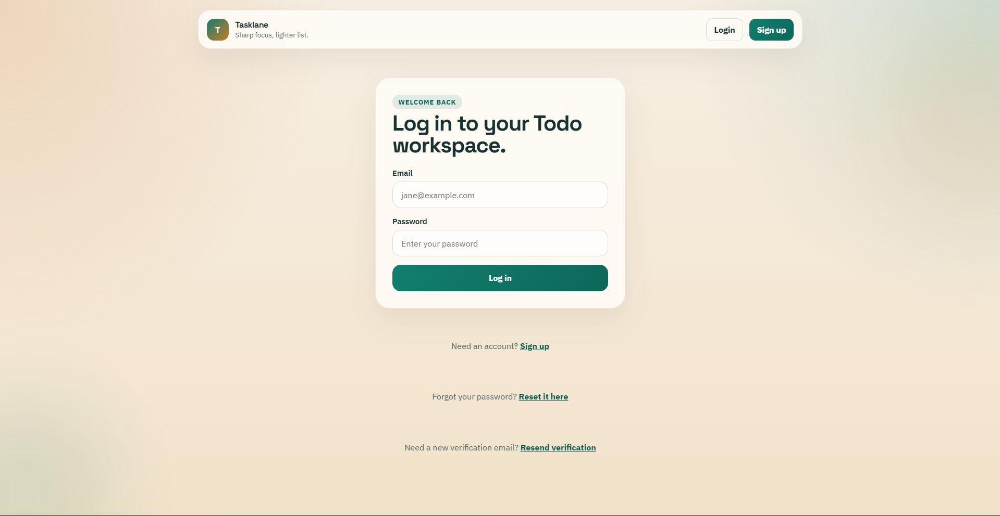
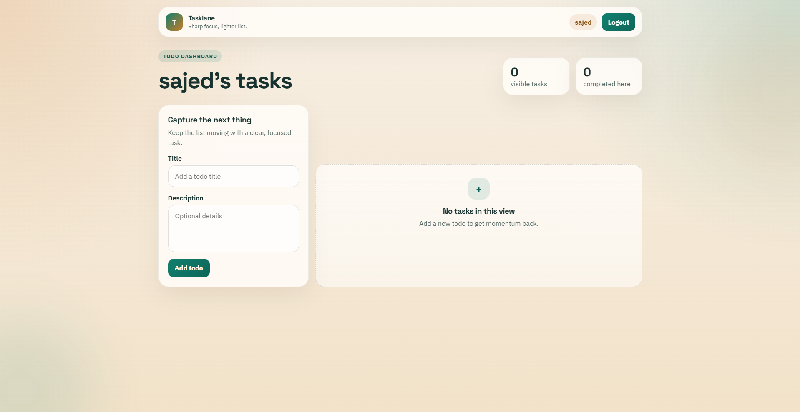

# Todo List App

A full-stack Todo List application built with a modern web stack.  
This project allows users to create an account, verify their email, log in securely, manage their tasks, and reset their password if needed.

## Tech Stack

### Frontend
- React
- JavaScript
- CSS Modules

### Backend
- NestJS
- TypeScript
- JWT Authentication
- Nodemailer

### Database
- PostgreSQL
- TypeORM
- Migrations

---

## Features

### Authentication
- User sign up
- User log in
- JWT-based authentication
- Protected routes
- Email verification system
- Only verified users can log in
- Resend verification email
- Forgot password flow
- Reset password flow

### Todo Management
- Create todos
- Edit todos
- Delete todos
- Mark todos as completed
- Reorder todos
- Personalized todo list for each user

### User Experience
- Success and error messages
- Clean UI
- Email verification flow
- Password reset flow
- Responsive layout
- Persistent login session

---

## Email Features
- Verification email sent after sign up
- Verification link to activate account
- Password reset email
- Secure token-based verification and reset flow

---

## Screenshots

### Main Page


### Todo Page After Login


---

## Project Structure

```bash
frontend/
server/
